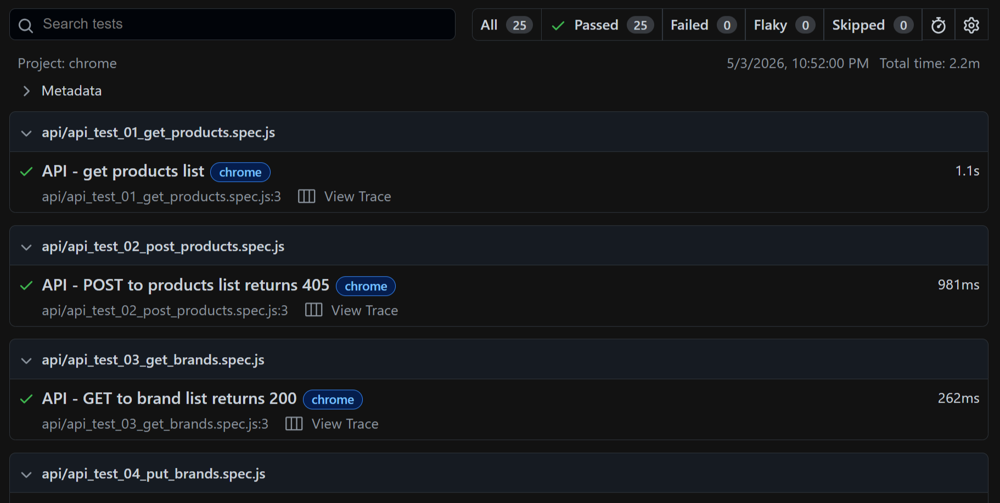

# Playwright End-to-End Automation Framework (JS) 🚀




This repository contains a professional-grade **End-to-End (E2E) Test Automation Framework** built with **Playwright** and **JavaScript**. It is designed to validate both UI and API layers of the [Automation Exercise](https://automationexercise.com/) platform.

## 📊 Project Status & Quality Metrics

- **Total Test Cases:** 25
- **Latest Execution:** 25 Passed / 0 Failed (100% Success Rate) ✅
- **CI/CD Integration:** Verified on **GitHub Actions** and **Jenkins**.
**Execution Environment:** Linux (Ubuntu) Headless & Windows Headed.


## 🌟 Key Features

- **Hybrid Framework:** Integrated UI and API testing in a single repository.
- **Page Object Model (POM):** Clean, modular, and maintainable code architecture.
- **CI/CD Integration:** Automated execution flows via **Jenkins**.
- **Ad-Blocker Logic:** Custom scripts to handle and bypass Google Vignette Ads.
- **Security:** Advanced secret management using `dotenv` and Jenkins Environment Variables.
- **Professional Reporting:** HTML reports featuring screenshots, videos, and trace logs for failures.

## 🛠️ Tech Stack

- **Tool:** Playwright
- **Language:** JavaScript (Node.js)
- **CI/CD:** Jenkins
- **Reporting:** Playwright HTML Reporter
- **Configuration:** Dotenv

## 🌟 Technical Challenges & Solutions

### 1. Dynamic Google Vignette Ads Bypass
The target platform frequently serves random, unpredictable Google Vignette ads that break standard automation flows.
- **My Solution:** I implemented a robust intercept and bypass logic using Playwright's Page Object Model. The framework dynamically detects the ad-frame and handles the dialog without failing the test suite.
- **Impact:** Achieved 100% reliability in headless CI environments where manual intervention is impossible.

### 2. Cross-Platform File Upload (Relative Path Resolution)
Handled the common "path mismatch" issue between Windows development machines and Linux-based CI servers.
- **My Solution:** Used the `path` module and dynamic directory resolution (`process.cwd()`) to ensure that file upload tests run seamlessly across different operating systems.

---


## 📂 Project Structure

```text
├── pages/                # Page Object Model (POM) files
├── tests/
│   ├── ui/               # UI test suites (.spec.js)
│   └── api/              # API test suites (.spec.js)
├── playwright.config.js  # Global Playwright settings
├── .env.local            # Local environment variables (Git ignored)
└── package.json          # Project dependencies & scripts

## 🚀 Getting Started
### Prerequisites
- Node.js (v18+)
- npm
### Installation

1. Clone the repository:
git clone https://github.com/qaselimgencer/playwright-test-automation.git
2. Install dependencies:
npm install
3. Install browsers:
npx playwright install

### Running Tests
- All Tests: npx playwright test
- UI Only: npx playwright test tests/ui
- API Only: npx playwright test tests/api
- Open Report: npx playwright show-report

## 🏗️ CI/CD Workflow (Jenkins)
The project is fully integrated into a Jenkins pipeline:
- SCM: Automatically pulls the latest code from the clean-main branch.
- Environment: Securely injects credentials via Jenkins Secret Files.
- Execution: Runs tests in headless mode for server compatibility.
- Artifacts: Archives results and displays the Playwright HTML Report directly on the Jenkins dashboard.
---
Author: Selim Gençer
```
